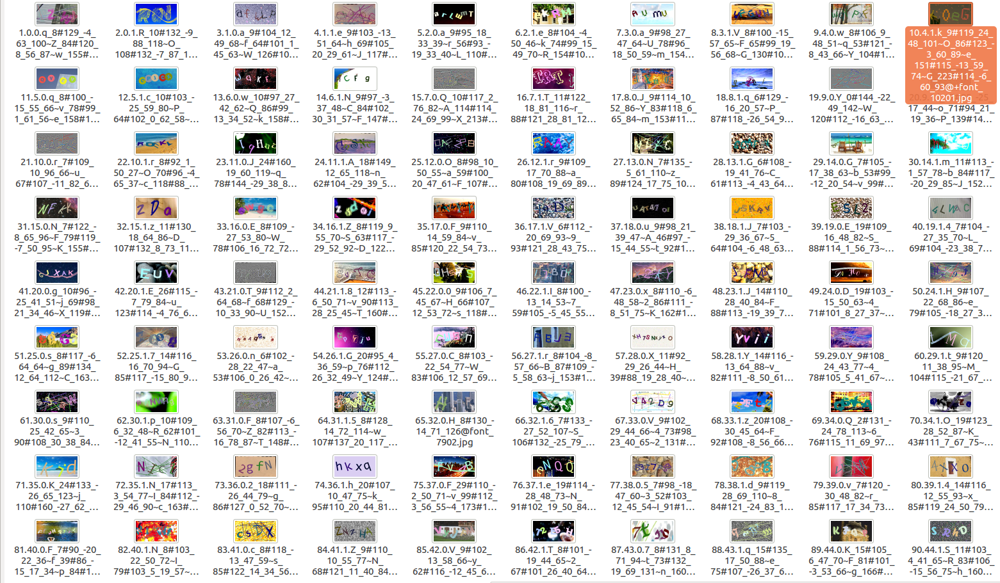

## 深度学习样本数据生成器：验证码样本数据生成
支持无限字体和无限背景图片，生成的图片可以随机扭曲，随机长度

生成的文件名称表示了该图片中的内容、每个字母所在坐标、旋转角度、宽度高度等

## 资源目录
将下载回来的字体放到application/Assets/fonts目录中

将下载回来的背景图片放到application/Assets/backgrounds目录中

## 代码依赖安装
composer install

## 关键备注(本脚本最大的价值在这里)
本代码开发测试字体下载自http://font.chinaz.com，已人工挑选出错误字体，并做相应处理（一共2万多种字体，处理后有效字体有1万多种）。

若使用本工具生成图片，建议批量下载来自font.chinaz.com的字体并解压，将所有字体放入资源文件夹中并执行：

    php app command:captcha-format-font 
 
这将删除无效字体，并对只能显示单英文/数字的字体进行分类处理，若自己确认没有问题的字体可以直接放到资源目录，而不必使用以上命令操作

    
## 执行命令
php app command:captcha-generator 

    参数:
      save-path             生成的图片保存目录 [default: "./data"]
      bath-size             每个字体生成多少张图片 [default: 100]
      font-number           第n个字体文件 [default: 0]
      font-end              第n个字体文件结束 [default: 0]
      img-width             图片宽度 [default: 300]
      img-height            图片宽度 [default: 150]
      
如：

    ➜  captcha-generator git:(master) php app command:captcha-generator ./data 2
    "共0张背景图片，11个字体文件。"
     已生成：1张，当前使用第0个字体文件
     10/22 [▓▓▓▓▓▓▓▓▓▓▓▓░░░░░░░░░░░░░░░░]  45% 已生成：11张，当前使用第5个字体文件
     20/22 [▓▓▓▓▓▓▓▓▓▓▓▓▓▓▓▓▓▓▓▓▓▓▓▓▓░░░]  90% 已生成：21张，当前使用第10个字体文件
     22/22 [▓▓▓▓▓▓▓▓▓▓▓▓▓▓▓▓▓▓▓▓▓▓▓▓▓▓▓▓] 100%%  

## 生成的图片文件名释义

    10.4.1.k_9#119_24_48_101~O_86#123_-3_60_89~e_151#115_-13_59_74~G_223#114_-6_60_93@+font_10201.jpg
        
    10.4.1.                 (本次生成第10张图片.第5个字体，第5个字体生成出来的第2张图片)              
    k_9#119_24_48_101       (图片上顺序第一个字符是小写的k_左下角x坐标值为9#y坐标值为119_文字旋转角度为24_文字宽度为48_文字高度为101) 
    ~                       (分隔每个字符)
    O_86#123_-3_60_89
    ~
    e_151#115_-13_59_74
    ~
    G_223#114_-6_60_93
    @
    +font_10201.jpg         (这张图片使用的字符的文件名称)
    
    
    

